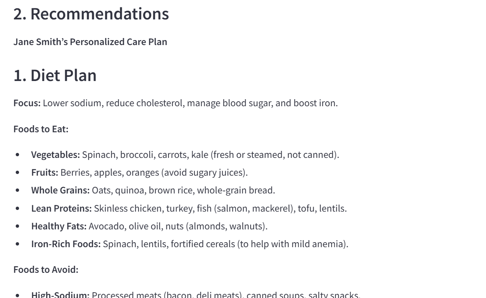

# **CardioCare: Cardiovascular Disease Diagnosis and Treatment Recommendation App**

CardioCare is a Streamlit-based web application designed to help users diagnose cardiovascular diseases and receive personalized treatment recommendations. The app uses the DeepSeek AI model to analyze medical reports and patient data, providing clear and actionable insights.

---

## **Table of Contents**
1. [Introduction](#introduction)
2. [Features](#features)
3. [Problems and Solutions](#problems-and-solutions)
4. [How to Use the App](#how-to-use-the-app)
5. [Screenshots](#screenshots)
6. [Installation](#installation)
7. [Running the App](#running-the-app)
8. [Dependencies](#dependencies)
9. [Contributing](#contributing)
10. [License](#license)

---

## **Introduction**
CardioCare is an AI-powered tool that assists in diagnosing cardiovascular diseases based on patient data and medical reports. It provides personalized recommendations for diet, exercise, medications, and prevention tips. The app is designed for both patients and healthcare professionals to simplify the process of understanding and managing cardiovascular health.

---

## **Features**
- **Disease Diagnosis**: Analyzes medical reports and patient data to diagnose cardiovascular diseases.
- **Personalized Recommendations**: Provides tailored diet plans, exercise routines, medication suggestions, and prevention tips.
- **User-Friendly Interface**: Easy-to-use interface for patients and healthcare providers.
- **PDF Upload**: Allows users to upload medical reports in PDF format for analysis.
- **AI-Powered Insights**: Uses the DeepSeek AI model for accurate and reliable recommendations.

---

## **Problems and Solutions**

### **Problem no 1: Incomplete Responses from AI**
- **Issue**: The AI sometimes provides incomplete responses due to token limits.
- **Solution**: Increased the `max_tokens` parameter in the API call to allow for longer responses. Optimized prompts to ensure concise yet complete outputs.

### **Problem 2: Unstructured Output**
- **Issue**: The output was not well-formatted, making it difficult for patients to understand.
- **Solution**: Used Markdown formatting to structure the output into clear sections (e.g., Diet Plan, Exercise, Medications, Prevention Tips).

### **Problem 3: Lack of Medical Report Analysis**
- **Issue**: The app initially did not prioritize the analysis of uploaded medical reports.
- **Solution**: Modified the prompts to ensure the AI focuses on the medical report and uses additional patient data as supplementary information.

### **Problem 4: Token Limit Errors**
- **Issue**: Long medical reports exceeded the token limit, causing errors.
- **Solution**: Added truncation logic to ensure the input text fits within the token limit while retaining critical information.

---

## **How to Use the App**

### **Step 1: Enter Patient Information**
- Input the patient's body temperature, blood pressure, and cholesterol level in the sidebar.

### **Step 2: Upload Medical Report**
- Upload a PDF file containing the patient's medical test report.

### **Step 3: Get Recommendations**
- Click the **"Get Recommendations"** button to analyze the data and generate a diagnosis and treatment plan.

### **Step 4: View Results**
- The app will display:
  - **Recognized Disease**: A concise diagnosis based on the medical report and patient data.
  - **Recommendations**: A personalized care plan including diet, exercise, medications, and prevention tips.

---

## **Screenshots**

### **1. Home Page**

*The home page of CardioCare with input fields and a PDF upload option.*

### **2. Diagnosis and Recommendations**

*The app displays the recognized disease and personalized recommendations.*

### **3. Structured Recommendations**

*Clear and structured recommendations for diet, exercise, medications, and prevention.*

---

## **Installation**

### **Prerequisites**
- Python 3.8 or higher
- Streamlit
- PyPDF2
- OpenAI
- python-dotenv

### **Steps**
1. Clone the repository:
   ```bash
   git clone https://github.com/yourusername/cardiocare.git
   cd cardiocare
2. Install the required dependencies:
```sh
pip install -r requirements.txt
```
3. Create a `.env` file with your AI/ML API key:
```sh
DEEPSEEK_API_KEY=your_api_key_here 
```
## Running the App
```sh
streamlit run app.py
```

## Contributing
  Contributions are welcome! If you'd like to contribute, please follow these steps:

1. Fork the repository.

2. Create a new branch for your feature or bug fix.

3. Commit your changes and push to the branch.

4. Submit a pull request.

## Contact
For questions or feedback, please contact:

### Hanzla

1. Email: khangormani79@gmail.com

2. [GitHub] (https://github.com/hanzlikhan)

3. [LinkedIn] (https://www.linkedin.com/in/muhammad-hanzla-787081279/) 

## Licence 
This project is licensed under the MIT License. See the LICENSE file for details.
